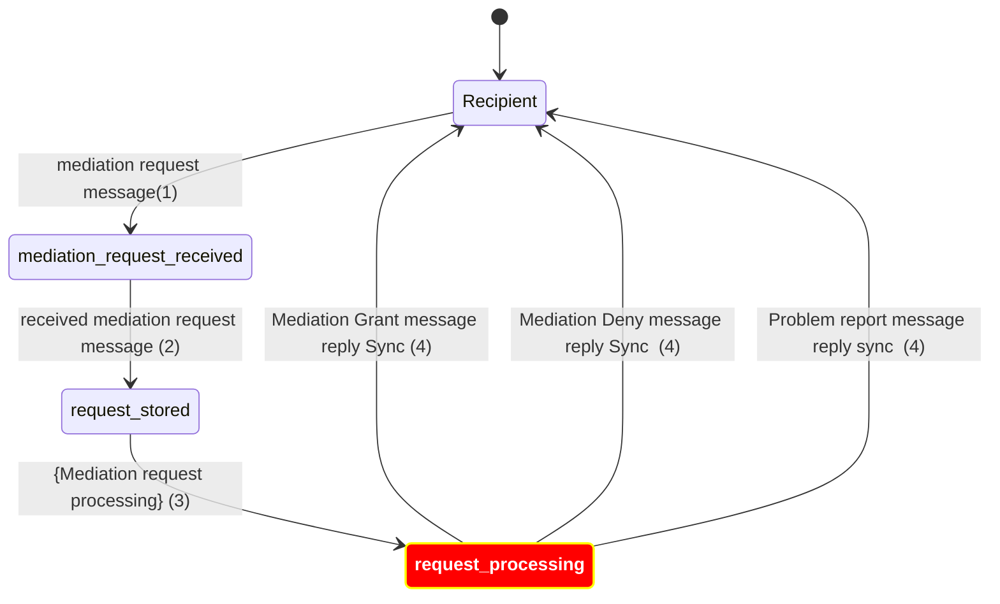
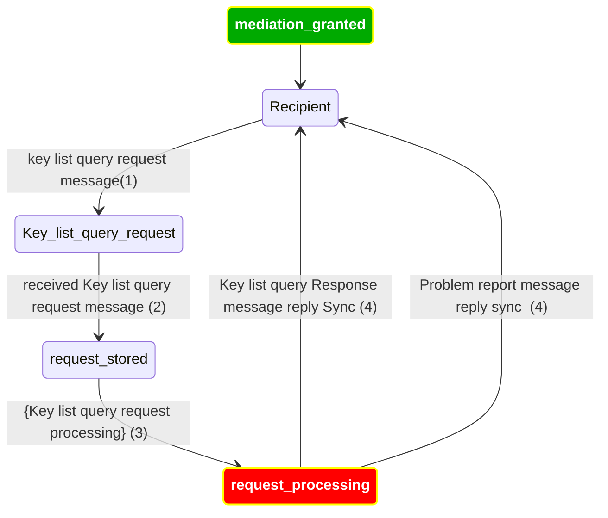
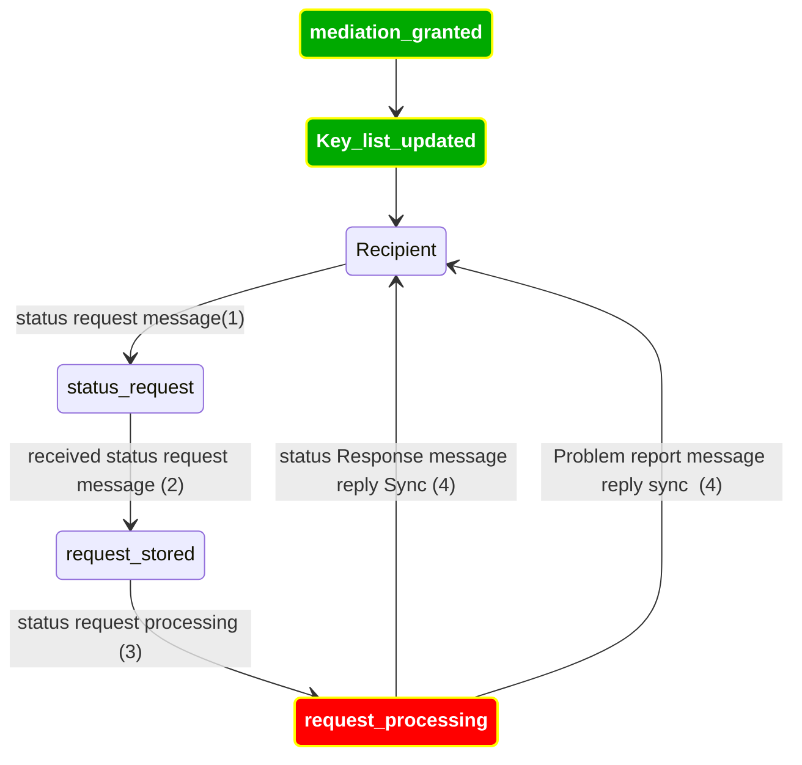
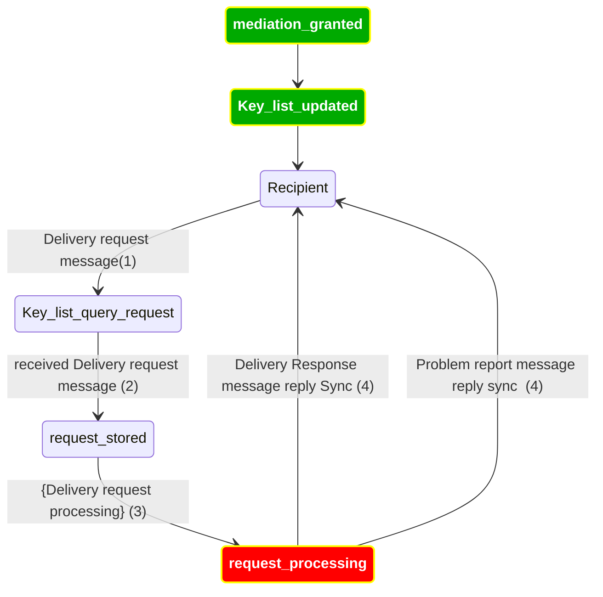
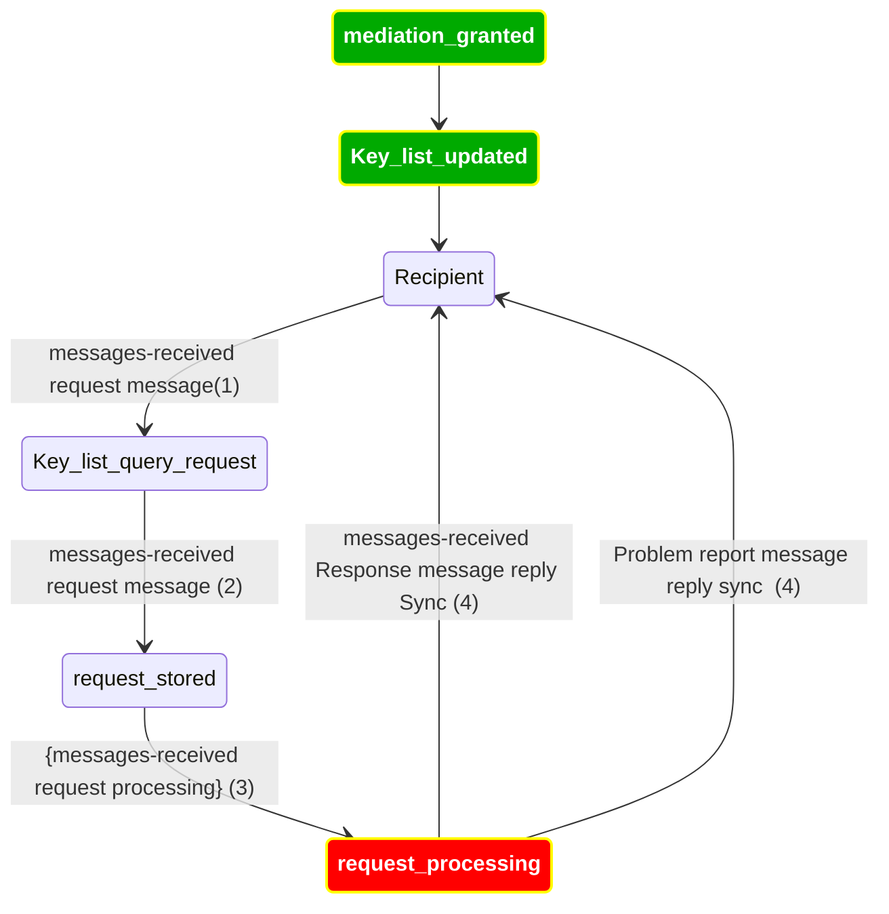
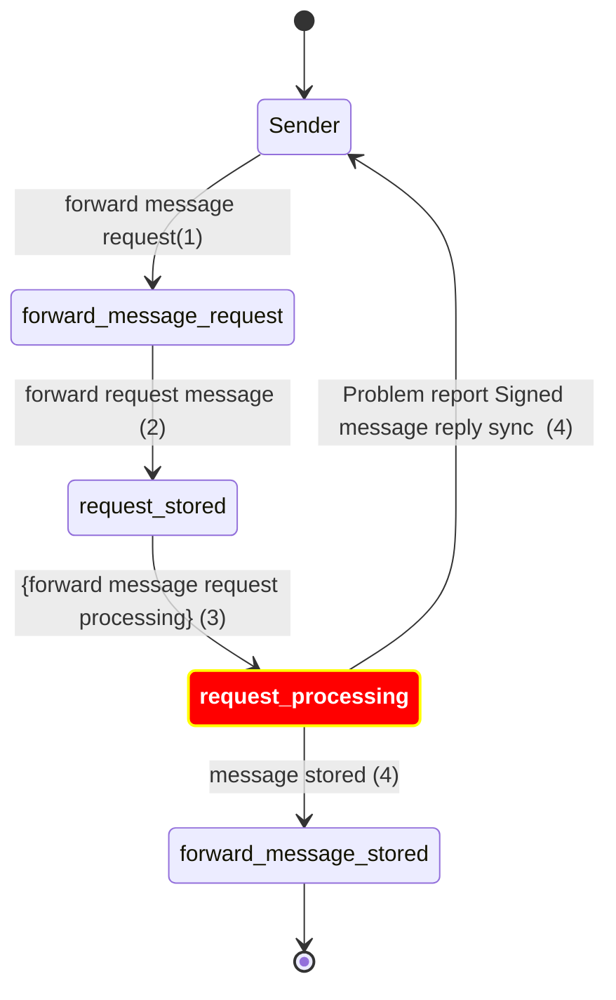

# Error Handling

https://identity.foundation/didcomm-messaging/spec/#problem-reports

On each step of all our protocols processing, when something wrong is happening, we need to:
Goals
- Update the record to a documented error state
- Log the error in the service logs
- Send the problem report message when appropriate

Goal other: error recover/resilient
- [optional] Send event that record state changed to error
- Decide on the policy of re-trying sending errors (one of the proposals is just to send it once, and if a recipient did not get this, then it’s on its own requesting record ID state)

Note: most errors in Mediator will be synchronous

- Store messages when sending (1w)
- Catch Errors and send Problem Reports (1w):
  - (sync) e.p.crypto - is message is tampering (any crypto error).
    - [WIP]
  - (sync) e.p.crypto.unsupported - is message is tampering (any crypto error).
    - [WIP]
  - (sync & async) e.p.crypto.replay - if the message is replay (possible he replay attack).
  - (sync) e.p.req - pickup message before enroling.
  - [DONE] StatusRequest - https://didcomm.org/messagepickup/3.0/status-request
  - [DONE] DeliveryRequest - https://didcomm.org/messagepickup/3.0/delivery-request
  - (sync) e.p.me.res.storage - connection MongoBD is not working.
  - [DONE] catch all StorageCollection Error
  - (sync) e.p.me.res.storage - business logic MongoBD is not working.
  - [DONE] catch all StorageThrowable
  - (sync) e.p.did - for any DID method that is not `did.peer`.
  - (sync) e.p.did.malformed - for any DID method malformed.
  - (sync) e.p.msg - for parsing error from the message.
    - [DONE] All parsing errors from the decrypt function
    - [TODO] parsing for a specific data model of each protocol
  - (sync) e.p.msg.unsupported - for the message type LiveModeChange and all message that is not role of the mediator
    - [DONE] MediateGrant
    - [DONE] MediateDeny
    - [DONE] KeylistResponse
    - [DONE] Status - https://didcomm.org/messagepickup/3.0/status
  - LiveModeChange Not Supported 
    - [DONE] "e.m.live-mode-not-supported" - https://didcomm.org/messagepickup/3.0/live-delivery-change
  - (sync) e.p.msg.unsupported - for parsing error due to unsupported version or protocol.
    - [DONE] MissingProtocolExecuter (unsupported protocol it also works fine for unsupported versions)
  - (sync & async) e.p.req.not_enroll - Get a Forward message to a DID that is not enrolled.
    - [DONE] Send a Problem Report if the next DID is not enrolled in the Mediator.
  - (sync & async) e.p.me - catch all error at the end.
    - [DONE]
- Receive a problem report (1w):
- in case of Warnings Reply `w.p` -> log warnings and escalate to an error `e.p` on the reply
- in case of Error `e.p` -> log error

- Traceability of the MsgID of the Problem Report to the original error (2d) -> ATL-4147
- [optional] Log - https://input-output.atlassian.net/browse/ATL-4147
- escalate_to must be configurable (1d)
- [optional] update the protocol with new tokens (2d)
  - `e.p.me.res.storage`
  - `e.p.me.res.not_enroll`

# Problem Reports in Mediator flow

https://didcomm.org/coordinate-mediation/2.0/mediate-request

https://didcomm.org/coordinate-mediation/2.0/keylist-update

https://didcomm.org/coordinate-mediation/2.0/keylist-query

Pickup 3.0 https://didcomm.org/pickup/3.0

https://didcomm.org/messagepickup/3.0/status-request

https://didcomm.org/messagepickup/3.0/delivery-request

https://didcomm.org/messagepickup/3.0/messages-received

Sender to Recipient (Sender use the type forward message)
https://didcomm.org/routing/2.0/forward
