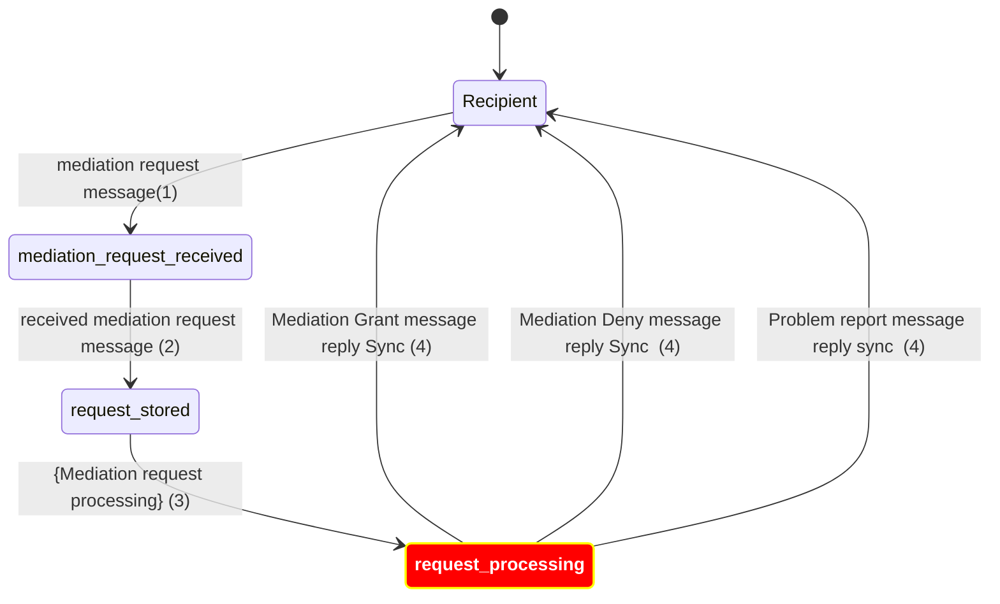
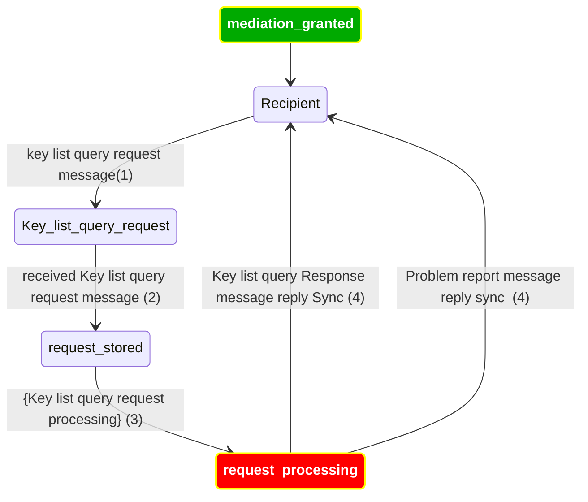
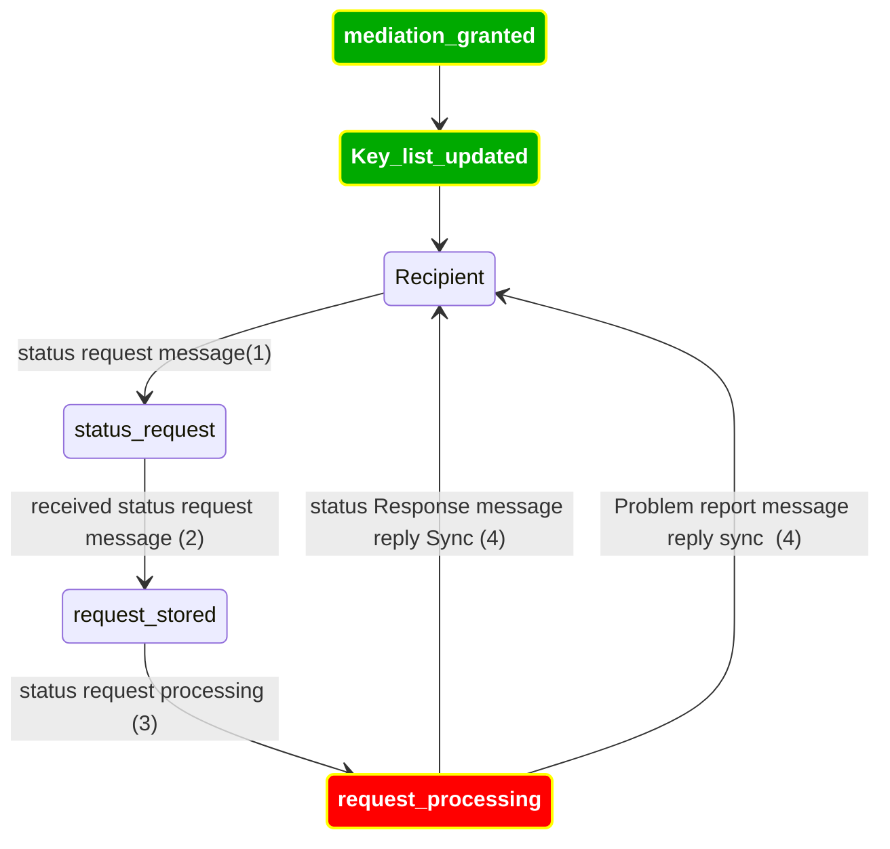
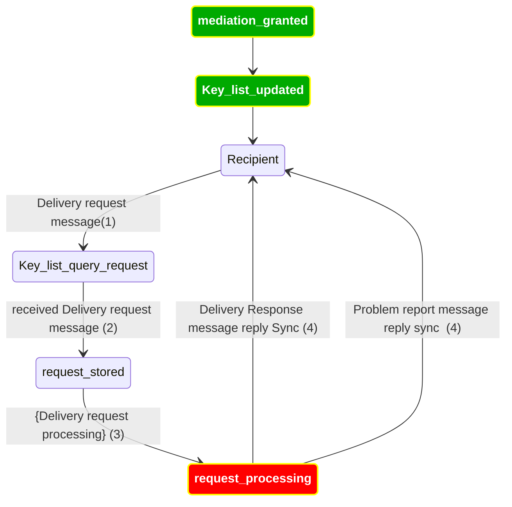
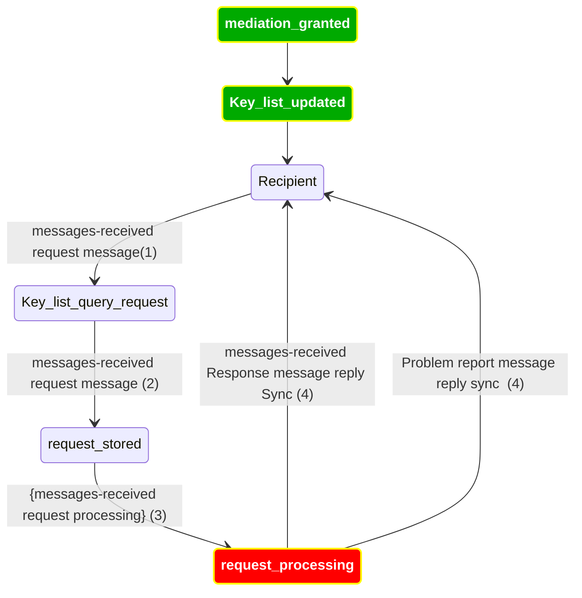
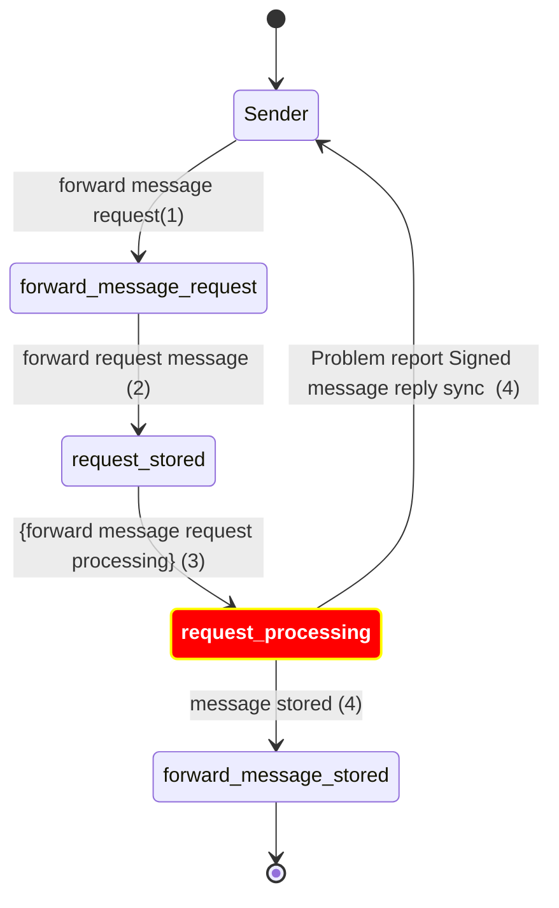

# Error Handling

When processing any step of any protocol, if something is wrong, the mediator tries to:
- Update the record to a documented error state
- Log the error in the service logs
- Send the problem report message when appropriate

https://identity.foundation/didcomm-messaging/spec/#problem-reports

## Custom behavior table

This table defines the expected behavior of the mediator in different scenarios not covered by the specifications.

| Mediators   | Atala Mediator | Roadmap Atala Mediator | RootsId | Blocktrust |
|-------------|----------------|------------------------|---------|------------|
| Scenario G1 | G1C            | -                      | ?       | ?          |
| Scenario G2 | G2A            | [TODO ATL-5840] G2B    | ?       | ?          |
| Scenario G3 | G3A            | [TODO (next)] G3B      | ?       | ?          |
| Scenario G4 | G4B            | -                      | ?       | ?          |
| Scenario G5 | Fallback G4B   | [TODO] G5B             | ?       | ?          |
| Scenario G6 | Fallback G4B   | [WIP] G6B              | ?       | ?          |
| Scenario G7 | Fallback G4B   | [TODO] G7B             | ?       | ?          |
| Scenario G8 | G8C            | -                      | ?       | ?          |
|             |                |                        |         |            |
| Scenario M1 | M1B            | -                      | ?       | ?          |
| Scenario M2 | M2B            | -                      | ?       | ?          |
| Scenario M3 | Fallback G4    | M3B                    | ?       | ?          |
| Scenario M4 | M4B            | -                      | ?       | ?          |
| Scenario M5 | M5A            | [TODO] M5B             | ?       | ?          |

### Scenarios Description

#### General Scenarios:

- **G1** - Received the exact same message (encrypted with the same ephemeral keys) (possible replay attack)
  - S1A - (default) executes the protocol as normal
  - S1B - ignore (no effect/output) 
  - S1C - Send a problem report "e.p.cryto.dejavu" ??? or "e.p.crypto.replay"
  - S1D - Reply with the exact same message (encrypted with the same ephemeral keys)

- **G2** - Receive a message for an unsupported protocol
  https://input-output.atlassian.net/browse/ATL-5840
  - G2A - ignore (no effect/output) 
  - G2B - Send a problem report `e.p.msg.unsupported`

- **G3** - Receive a message for an unsupported version of the protocol.
  - G2B - Fallback to G2
  - G3B - Send a problem report `e.p.msg.unsupported` and say what version(s) its supported

- **G4** - When an internal error or any unexpected error happens.
  - G4A - ignore (no effect/output) 
  - G4B - Send a problem report "e.p.error"

- **G5** - If the message is tampered or got any crypto errors when decoding.
  - G5A - ignore (no effect/output) 
  - G5B - (sync!) Send a problem report "e.p.crypto"

- **G6** - If the DID method is not supported (`did.peer` in this case)
  - G6A - ignore (no effect/output)
  - G6B - (sync!) e.p.did 

- **G7** - If the DID method is malformed.
  - G7A - ignore (no effect/output)
  - G7B - (sync!) e.p.did.malformed

- **G8** - When a parsing error from the decrypted message.
  - G8A - ignore (no effect/output)
  - G8B - (sync!) Send a problem report `e.p.msg` if the plaintext message is malformed 
  - G8C - Send a problem report `e.p.msg.<PIURI>` if the plaintext message is malformed or if parsing into a specific protocol's data model fails.

#### Mediator especific Scenarios:

- **M1** - Receive a pickup message from a DID not enrolled.
  - M1A - ignore (no effect/output) 
  - M1B - Send a problem report "e.p.req.not_enroll"

- **M2** - Connection to the BD is not working (at the moment of the call).
  - G4
  - M2A - ignore (no effect/output)
  - M2B - Send a problem report "e.p.me.res.storage" (maybe mention the try again later)

- **M3** - Business logic in BD is failing (got some error from the query).
  - G4
  - M3A - ignore (no effect/output)
  - M3B - Send a problem report "e.p.me.res.storage"

- **M4** - Get a Forward message to a DID that is not enrolled.
  - M4A - ignore (no effect/output)
  - M4B - Send a problem report "e.p.req.not_enroll" (the `next` DID is not enrolled)

- **M5** - LiveModeChange https://didcomm.org/messagepickup/3.0/live-delivery-change
  - Follow the protocol -> Upon receiving the `live_delivery_change` message with `live_delivery` set to `true``:
    - M5A - If the connection supports live delivery respond with a [`status`](https://didcomm.org/messagepickup/3.0/status) message.
    - M5B - If the connection is incapable of live delivery send a problem report `e.m.live-mode-not-supported`

### Considerations

In the Atala PRISM Mediator, when an issue arises, we undertake the following steps:
* Log the error.
* Dispatch a problem report as outlined in the aforementioned table.
* Record the problem report and error information in the database.
Every one of these steps should be traceable back to the initial call via a XRequestID,
and by the MsgID (which is the SHA-251 hash of the encrypted message).
This procedure will enhance Level 3 support and debugging capabilities. (For [ATL-4147](https://input-output.atlassian.net/browse/ATL-4147))

[TODO optional] Would be nice to propose a list/table of new tokens to the protocol specs:
  - `e.p.me.res.storage`
  - `e.p.me.res.not_enroll`

## Problem Reports in Mediator flow

https://didcomm.org/coordinate-mediation/2.0/mediate-request

https://didcomm.org/coordinate-mediation/2.0/keylist-update

https://didcomm.org/coordinate-mediation/2.0/keylist-query

Pickup 3.0 https://didcomm.org/pickup/3.0

https://didcomm.org/messagepickup/3.0/status-request

https://didcomm.org/messagepickup/3.0/delivery-request

https://didcomm.org/messagepickup/3.0/messages-received

Sender to Recipient (Sender use the type forward message)
https://didcomm.org/routing/2.0/forward

