# SCALA DID

A Scala/ScalaJS library for DID and DIDcomm

- Decentralized Identifiers (DIDs) v1.0 - W3C Proposed Recommendation 03 August 2021 [LINK GitHub](https://w3c.github.io/did-core/) or [LINK W3C](https://www.w3.org/TR/did-core/)
- DID Comm - <https://identity.foundation/didcomm-messaging/spec/>
- DID Comm protocols - <https://didcomm.org/search/?page=1>

## Project Structure and Dependencies Graph

```mermaid
flowchart BT

  did --> zio
  did --> zio-json
  did-web ---> zhttp:::JVM
  zhttp --> zio

  subgraph fmgp
    %%did-implementation[did-implementation\n]

    subgraph platform specific
      did-implementation_jvm:::JVM
      did-implementation_js:::JS
    end

    did-implementation_jvm:::JVM --> did
    did-implementation_js:::JS --> did
    
    did-peer --> did
    did-web --> did
  end
  
  
  did-implementation_jvm:::JVM ---> nimbus-jose-jwt:::JVM --> google-tink:::JVM
  did-implementation_jvm:::JVM ---> google-tink

  did-implementation_js ---> jose:::JS 


  did-implementation-hw:::Others ---> did


  classDef JVM fill:#141,stroke:#444,stroke-width:2px;
  classDef JS fill:#05a,stroke:#444,stroke-width:2px;
  classDef Others fill:#222,stroke:#444,stroke-width:2px,stroke-dasharray: 5 5;

```

NOTES:

- The things inside the group box (fmgp) are implemented by this library.
- Green boxes is JVM's platform specific.
- Blue boxes is JavaScript's platform specific.
- Other boxes are not platform specific.
- The `did-implementation-hw` is a idea how to extend for other implementation. Lika a Hardware/platform specific.
- `did-web` & `did-peer` are implementations of the respective did methods.

## build and run app (open chrome)

`sbt>` `webapp/fastOptJS::webpack`

open `file:///home/fabio/workspace/ScalaDID/webapp/index-fastopt.html#/`

google-chrome-stable --disable-web-security --user-data-dir="/tmp/chrome_tmp" --new-window file:///home/fabio/workspace/ScalaDID/webapp/index-fastopt.html#/

## Limitations

### WIP

- We are still working on API.

### Limitations in JS

ATM no library was native JavaScript support for `ECHD-1PU` and `XC20P`.

[For an encrypted DIDComm message, the JWA of `ECDH-1PU` MUST be used within the structure of a JWE.](https://identity.foundation/didcomm-messaging/spec/#sender-authenticated-encryption)

The `XC20P` used for Anoncrypt but is optional.

You can read the [JavaScript JOSE Proposal](<https://hackmd.io/@IyhpRay4QVC_ozugDsQAQg/S1QlYJN0d>) from DIF (Decentralized Identity Foundation).
Also the discussion on the `jose` npm Library <https://github.com/panva/jose/discussions/237>

### Future Work

DID Credentials -> [Verifiable Credentials Data Model v1.1](https://www.w3.org/TR/vc-data-model/)

## Troubleshooting (Node v17)

Error `Error: error:0308010C:digital envelope routines::unsupported`
export NODE_OPTIONS=--openssl-legacy-provider
