# SCALA DID

A Scala/ScalaJS library for DID and DIDcomm.
The one of the main goals of this library is to make DID Comm v2 **type safety** and easy to use.


[](https://github.com/FabioPinheiro/scala-did/actions/workflows/ci.yml)
[](https://github.com/FabioPinheiro/scala-did/actions/workflows/scala-steward.yml)
 - **CI** automate builds and tests all pushes to the master branch also as all PRs created.
 - **Scala Steward** automate the creation of pull requests for libraries with updated dependencies, saving maintainers time and effort. It can also help ensure that libraries are kept up-to-date, improving their reliability and performance.


**More documentation:**
- [LICENSE](LICENSE) - Apache License, Version 2.0
- [did implementations](did-imp/README.md) = Notes and TODO list
- [example](did-example/README.md) - just a set of DIDs for experiments.
- [demo](demo/README.md) - How to build, test and deploy the Demo. The Demo is a server with (webapp) client.  
- [webapp module](webapp/README.md) - How to build, develop and run localy.
- [multiformats module](multiformats/README.md) -(Implemente notes and an considerations (of TODOs) if we want to use as the independent Library.
- [docs](docs/) - [WIP/TODO] Base of the library documentation website.
  <!-- - [docs/readme.md](docs/readme.md) - TODO -->

**External documentation / Links:**
- Decentralized Identifiers (DIDs) v1.0 - W3C Proposed Recommendation 03 August 2021 [LINK GitHub](https://w3c.github.io/did-core/) or [LINK W3C](https://www.w3.org/TR/did-core/)
- DID Comm - <https://identity.foundation/didcomm-messaging/spec/>
- DID Comm protocols - <https://didcomm.org/search/?page=1>
- DID Comm - Wallet and Credential Interaction (WACI) - https://identity.foundation/waci-didcomm/
- Future Work (maybe):
  - DID Credentials -> [Verifiable Credentials Data Model v1.1](https://www.w3.org/TR/vc-data-model/)
## Benefits of type safety

- It would help prevent errors by ensuring that only valid DIDs are used, and that the library does not attempt to perform any invalid operations on them. This could help ensure that the library functions correctly and reliably.

- It would make the code easier to read and understand, by making it clear what types of values are being used and what operations are being performed on them. This could make it easier for developers to work with the library and understand its functionality. **Speeding up the development of applications**

- It could make the library more efficient, by allowing the compiler to optimize the code for working with DIDs. This could make the library run faster and more efficiently.

- It could improve the reliability and correctness of the library, by catching any errors or bugs related to invalid DIDs or invalid operations at compile time. This could save time and effort in the development process and help prevent potential issues in the final library.

I usually say if it compiles it probably also works! 

## Project Structure and Dependencies Graph

```mermaid
flowchart BT

  did --> zio
  zhttp --> zio
  did --> zio-json

  did-resolver-web ----> zhttp:::JVM

  subgraph fmgp libraries
    subgraph platform specific
      did-imp
      did-imp_jvm:::JVM ==>|compiles together| did-imp
      did-imp_js:::JS ==>|compiles together| did-imp
      did-imp-hw:::Others -.-> did-imp
    end
    did-imp --> did
    %% did-imp_jvm:::JVM --> did
    %% did-imp_js:::JS --> did
    
    did-resolver-peer --> multibase
    did-resolver-peer --> did
    did-resolver-web --> did
  end
  
  did-imp_jvm:::JVM ----> nimbus-jose-jwt:::JVM --> google-tink:::JVM
  did-imp_jvm:::JVM ---> google-tink

  did-imp_js ----> jose:::JS

  %% subgraph demo/docs
    webapp:::JS --> did-imp_js
    webapp:::JS  --> did-resolver-web
    webapp:::JS  --> did-resolver-peer
    demo --> did-resolver-web
    demo --> did-resolver-peer
    demo --> did-imp 
    demo -.->|uses\serves| webapp
    demo_jvm(demo_jvm\nA server):::JVM ==>|compiles together| demo
  %% end

  classDef JVM fill:#141,stroke:#444,stroke-width:2px;
  classDef JS fill:#05a,stroke:#444,stroke-width:2px;
  classDef Others fill:#222,stroke:#444,stroke-width:2px,stroke-dasharray: 5 5;

```



NOTES:

- The things inside the group box (fmgp) are implemented on this repository and that are intended to be published as a library.
- Green boxes is JVM's platform specific.
- Blue boxes is JavaScript's platform specific.
- Other boxes are not platform specific.
- The `did-imp-hw` is a idea how to extend for other implementation. Lika a Hardware/platform specific.
- `did-resolver-web` & `did-resolver-peer` are implementations of the respective did methods.

## Test coverage

1. `sbt clean coverage testJVM` - Run test
2. `sbt coverageReport` - Generate reports
3. `sbt coverageAggregate` - Aggregate reports

|   date   |  all  |  did  |did-imp|did-resolver-web|did-resolver-peer
|:--------:|:-----:|:-----:|:-----:|:--------------:|:--------------:
|2022-11-26|29.21 %|25.31 %|57.60 %|     81.58 %    |     27.50 %

You should open the reports with your browser. The reports will be in each module `target/scala-<scala-version>/scoverage-report`
- [all/aggregate](/target/scala-3.2.2-RC1/scoverage-report/index.html) - file:///home/fabio/workspace/ScalaDID/target/scala-3.2.2-RC1/scoverage-report/index.html
- [did](/did/jvm/target/scala-3.2.2-RC1/scoverage-report/index.html) - file:///home/fabio/workspace/ScalaDID/did/jvm/target/scala-3.2.2-RC1/scoverage-report/index.html
- [did-imp](/jvm/target/scala-3.2.2-RC1/scoverage-report/index.html) - file:///home/fabio/workspace/ScalaDID/did-imp/jvm/target/scala-3.2.2-RC1/scoverage-report/index.html
- [did-resolver-web](/jvm/target/scala-3.2.2-RC1/scoverage-report/index.html) - file:///home/fabio/workspace/ScalaDID/did-resolver-web/jvm/target/scala-3.2.2-RC1/scoverage-report/index.html
- [did-resolver-peer](/jvm/target/scala-3.2.2-RC1/scoverage-report/index.html) - file:///home/fabio/workspace/ScalaDID/did-resolver-peer/jvm/target/scala-3.2.2-RC1/scoverage-report/index.html

### WIP

- We are still working on core API.
- Publish to maven
  - scala-cli example
    - `docker run --rm  -it --entrypoint /bin/sh virtuslab/scala-cli`
    - `scala-cli repl --dependency app.fmgp::did_3::0.0.0+180-b8a47cfb-SNAPSHOT --repo https://maven.pkg.github.com/FabioPinheiro/scala-did`
  - docker with scala-cli
- create module for protocols

### TODO Protocols
- `Routing`- https://didcomm.org/routing/2.0
  - Also see https://didcomm.org/book/v2/routing
- `BasicMessage 2.0` - https://didcomm.org/basicmessage/2.0
- `ReportProblem 2.0` - https://didcomm.org/report-problem/2.0
- `TrustPing 2.0` - https://didcomm.org/trust-ping/2.0/
- `DiscoverFeatures 2.0` - https://didcomm.org/discover-features/2.0
- Create new protocol `PreSetValue`
- Create new protocol `PseudoRandom`
  - https://www.stat.berkeley.edu/~stark/Java/Html/sha256Rand.htm
  - https://www.rfc-editor.org/rfc/rfc3797

### Limitations in JS ATM

ATM no library has native JavaScript support for `ECHD-1PU` and `XC20P`.
- `ECHD-1PU` is used to create AUTHCRYPT message
- `XC20P` is optional and is used for content encryption of the message on ANONCRYPT

[For an encrypted DIDComm message, the JWA of `ECDH-1PU` MUST be used within the structure of a JWE.](https://identity.foundation/didcomm-messaging/spec/#sender-authenticated-encryption)

The `XC20P` used for Anoncrypt but is optional.

You can read the [JavaScript JOSE Proposal](<https://hackmd.io/@IyhpRay4QVC_ozugDsQAQg/S1QlYJN0d>) from DIF (Decentralized Identity Foundation).
Also the discussion on the `jose` npm Library <https://github.com/panva/jose/discussions/237>

### **Warning** about arbitrary JSON

- **Considerations about potential attacks on arbitrary JSON**

ATM the field `attachments` in `PlaintextMessage` is arbitrary JSON.
Like almost all json decoder libraries is easy for the final user to introduce potential well-known DOS attacks vectors.

**Solution one**

We plan to make a parametric `[T]` version of `PlaintextMessage` where the `attachments` is a type `T` (defined by the user).
On this version, the user needs to provide a `given` that encoded that type at compile time!

We will provide a macro that generates this decoder at compile time for `T`. Based on all DID Comm message types the user wants to support.

`T` is the union type of all DID Comm message types supported by the user.
The specialized decoder of a message will be chosen by the field `type` of the message.


With the macro provided by `zio.json`. The user can automatically generate highly optimized encoders and decoders at compile type. For each DID Comm message types.


**Solution two**

This solution will be an addition with what we have.

We will have a method on `PlaintextMessage`, where the attachments data will be bytes/string.

So the user can do whatever he wants. _It still has the same vulnerabilities considerations as what we have, but is no longer our responsibility_

## Troubleshooting

- On Node v17 you need use the legacy openssl:

  - Error: `error:0308010C:digital envelope routines::unsupported`
  - Solution:
    ```shell
    export NODE_OPTIONS=--openssl-legacy-provider
    ```

