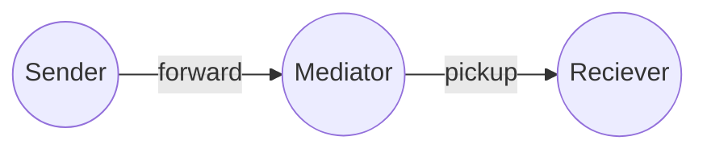
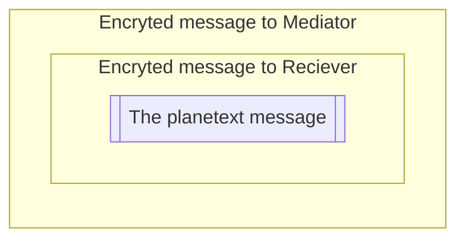

# Atala Prism Mediator (DIDCOMM v2)

A DID Comm v2 mediator  
A service that receives messages for many agents at a single endpoint and stores them with privacy.
A cloud-based agent that forwards messages to mobile devices.

 - **CI** automate builds and tests all pushes to the main branch also as all PRs created.
 - **Scala Steward** automate the creation of pull requests for libraries with updated dependencies, saving maintainers time and effort. It can also help ensure that libraries are kept up-to-date, improving their reliability and performance.

**More documentation:**
- [LICENSE](LICENSE) - Apache License, Version 2.0

## Description

DID Comm v2 (Decentralized Identifiers Communication Version 2) is a protocol designed for secure, private, and decentralized communication between different entities using decentralized identifiers (DIDs). A DID Comm v2 Mediator acts as an intermediary in the communication process, facilitating the exchange of messages between the parties involved. Here's a high-level description of how a DID Comm v2 Mediator works:

- Establishing logical connections: The Mediator enables entities (such as individuals or organizations) to establish secure connections with each other. Each entity has a unique DID that serves as its identifier on the decentralized network.
- DID resolution: When an entity wants to communicate with another entity, it resolves the recipient's DID to obtain the necessary information to establish a connection. The resolution process involves retrieving the recipient's public key and associated metadata from a decentralized identity infrastructure, such as a blockchain or a distributed ledger.
- Message encryption: The sender encrypts the message two times (one for the final receiver and then warp the encrypted message and encrypt again to Mediator) using the mediator's and recipient's public key obtained during the DID resolution process. This ensures that only the intended recipient can decrypt and read the message.

- Message routing: The sender sends the encrypted message to the Mediator. The Mediator acts as a routing agent, receiving messages from one entity, decrypted one layer and forwarding them to the intended recipient based on their DID.
- Mediation process: The Mediator verifies the authenticity and integrity of the incoming message by checking the digital signature attached to it. This signature ensures that the message was indeed sent by the claimed sender and that it hasn't been tampered with during transmission.

- Message decryption: After verifying the message's authenticity, the Mediator decrypted one layer of the message using the mediator's private key, which is securely held by the mediator. Once decrypted, the next message becomes readable (the final planetext intended for the final user it's still encrypted).
- Optional processing: The Mediator may perform additional processing on the message based on predefined rules or business logic. This could include applying filters, applying policies, or invoking external services.
- Message forwarding: If necessary, the Mediator can further forward the decrypted message to additional entities in the communication flow. This enables multi-party communication scenarios.

By acting as an intermediary, the DID Comm v2 Mediator helps facilitate secure and private communication between entities while leveraging the decentralized nature of DIDs and cryptographic techniques to ensure authenticity, integrity, and confidentiality of the messages exchanged.

The mediator is especially useful when the edge entities are not always online, like mobile devices. Usually, we can assume that the mediator is always online.

## Protocols
- [DONE] `BasicMessage 2.0` - https://didcomm.org/basicmessage/2.0
- [DONE] `MediatorCoordination 2.0` - https://didcomm.org/mediator-coordination/2.0
- [TODO] `MediatorCoordination 3.0` - https://didcomm.org/mediator-coordination/3.0
- [DONE] `Pickup 3` - https://didcomm.org/pickup/3.0
- [DONE] `TrustPing 2.0` - https://didcomm.org/trust-ping/2.0/

## How to run

### server

**Start the server**:
 - shell> `docker-compose up mongo`
 - sbt> `mediator/reStart`
### webapp

The webapp/webpage is atm just to show the QRcode with out of band invitation for the Mediator.

**Compile** - sbt> `webapp / Compile / fastOptJS / webpack`

**Open the webpage for develop** - open> `file:///.../webapp/index-fastopt.html`

## Run

This DIDComm Mediator is composed of two elements, a backend service and a the database.
The backend service is a JVM application and the database used is MongoDB.
The backend service is also a web service that have a single page application that will give the final user a invitation page.

### Run localy

Everything can be run with a single command with Docker compose `docker-compose.yml`

First build to docker image with `NODE_OPTIONS=--openssl-legacy-provider sbt docker:publishLocal`.
The latest stable image version can also downloaded from the IOHK repositories.

### MongoBD

Docker compose would do that for you but if you are running separately or on the cloud like MongoDB Atlas.
You will need to create the table and indexs before start the backend service. See the file `initdb.js`.

### Deploy

You can easy deploy the image everywhere. We recommend a minimum of 250 mb ram to run the mediator backend service.
