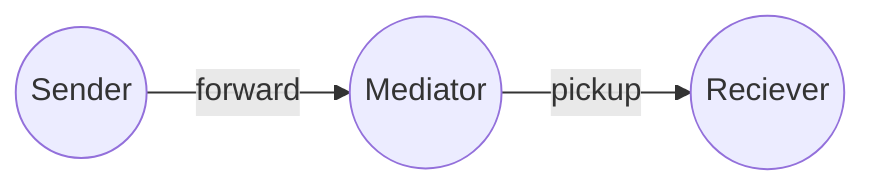

# Atala Prism Mediator (DIDCOMM v2)

A DIDCOMM v2 mediator  
A service that receives messages for many agents at a single endpoint and stores them with privacy.
A cloud-based agent that forwards messages to mobile devices.

 - **CI** automate builds and tests all pushes to the main branch also as all PRs created.
 - **Scala Steward** automate the creation of pull requests for libraries with updated dependencies, saving maintainers time and effort. It can also help ensure that libraries are kept up-to-date, improving their reliability and performance.

**More documentation:**
- [LICENSE](LICENSE) - Apache License, Version 2.0

## Protocols
- [DONE] `BasicMessage 2.0` - https://didcomm.org/basicmessage/2.0
- [WIP] `MediatorCoordination 2.0` - https://didcomm.org/mediator-coordination/2.0
- [DONE] `Pickup 3` - https://didcomm.org/pickup/3.0
- [DONE] `TrustPing 2.0` - https://didcomm.org/trust-ping/2.0/

## How to run

### server

**Start the server**:
 - shell> `docker-compose up mongo`
 - sbt> `mediator/reStart`
### webapp

The webapp/webpage is atm just to show the QRcode with out of band invitation for the Mediator.

**Compile** - sbt> `webapp / Compile / fastOptJS / webpack`

**Open the webpage for develop** - open> `file:///.../webapp/index-fastopt.html`
