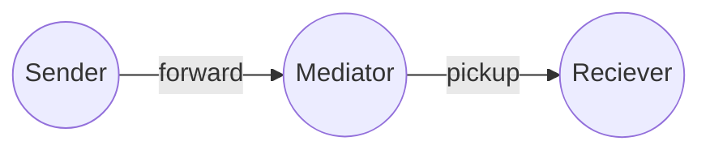
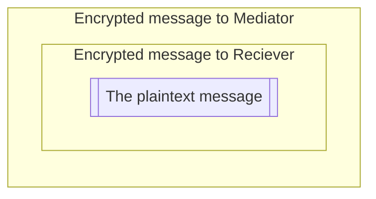

|            Live Demo           |     Discord    |     Atala PRISM Website      |
| ------------------------------ | -------------- | -----------------------------|
|[![Atala-Symbol]][Link-LiveDemo]|![Badge-Discord]|[![Atala-Favicon]][Link-Atala]|

|      CI       | Project Stage  |   Commits since latest release   |
| ------------- | -------------- | -------------------------------- |
|![CI][Badge-CI]| ![Badge-Stage] |![Badge-CommitsSinceLatestRelease]|

# Atala Mediator

A DID Comm v2 mediator  
A service that receives messages for many agents at a single endpoint and stores them with privacy.
A cloud-based agent that forwards messages to mobile devices.



 - **CI** automate builds and tests all push to the main branch also as all PRs created.
 - **Scala Steward** automates the creation of pull requests for libraries with updated dependencies, saving maintainers time and effort. It can also help ensure that libraries are kept up-to-date, improving their reliability and performance.


# Table of contents:
- [Mediator Purpose](#Description)
- [Protocols Supported](#Protocols)
  - [Mediator Protocol State and Flow](Coordinate-Mediation-Protocol.md)
- [Pre-reqs](#pre-reqs)
- [Getting started](#getting-started)
  - [Docker only](#docker-only)
- [Configuring the mediator](#configure-the-mediator)
    - [Mediator identity](#identity)
    - [Mediator storage](#mediator-storage)
      - [Mediator-Storage-In-cloud](#mongodb-in-cloud) 
- [Mediator Deployment](#deploy)
- [Mediator Test suite](#mediator-tests)
- [Mediator Error Handling](Mediator-Error_Handling.md#error-handling)  
- [Mediator protocols state flow with problem reporting](Mediator-Error_Handling.md#problem-reports-in-mediator-flow)

## Description

DID Comm v2 (Decentralized Identifiers Communication Version 2) is a protocol engineered for secure, private, and decentralized communications between various entities utilizing decentralized identifiers (DIDs). A DID Comm v2 Mediator functions as an intermediary in the communication process, streamlining the exchange of messages among the involved parties.


- Establishing Logical Connections - The Mediator empowers entities, which could be individuals or organizations, to forge secure connections amongst themselves. Each entity possesses a unique DID that acts as its identifier within the decentralized network.
- DID resolution - When an entity seeks to communicate with another, it resolves the recipient's DID to procure the information necessary to establish a connection. This resolution procedure entails retrieving the recipient's public key and correlated metadata from a decentralized identity infrastructure, which could be a blockchain or distributed ledger.
- Message encryption - The sender employs a double encryption technique for the message: initially for the ultimate receiver, and subsequently encapsulates the encrypted message within another encryption layer for the Mediator. This is achieved using the public keys of both the Mediator and the recipient obtained through the DID resolution process. Dual encryption ensures that only the intended recipient has the capacity to decrypt and access the message.



- Message routing - The sender transmits an encrypted message to the Mediator, which serves as a routing agent. In this role, the Mediator receives messages from the sender, decrypts one layer, and forwards them to the appropriate recipient based on the recipient's DID.
- Mediation process- The Mediator verifies the authenticity and integrity of the incoming message by checking the digital signature attached to it. This signature ensures that the message was indeed sent by the claimed sender and that it hasn't been tampered with during transmission.

- Message decryption - After verifying the message's authenticity, the Mediator decrypted one layer of the message using the mediator's private key, which is securely held by the mediator. Once decrypted, the next message becomes readable (the final plaintext intended for the final user it's still encrypted).
- Optional processing - The Mediator may perform additional processing on the message based on predefined rules or business logic. This could include applying filters, applying policies, or invoking external services.
- Message forwarding - If necessary, the Mediator can further forward the decrypted message to additional entities in the communication flow. This enables multi-party communication scenarios.

By acting as an intermediary, the DID Comm v2 Mediator helps facilitate secure and private communication between entities while leveraging the decentralized nature of DIDs and cryptographic techniques to ensure the authenticity, integrity, and confidentiality of the messages exchanged.

The mediator is especially useful when the edge entities are not always online, like the mobile paradigm. Usually, we can assume that the mediator is always online.

## Protocols
- [DONE] `BasicMessage 2.0` - https://didcomm.org/basicmessage/2.0
- [DONE] `MediatorCoordination 2.0` - https://didcomm.org/mediator-coordination/2.0
 - See [link for the protocol specs](/Coordinate-Mediation-Protocol.md)
- [TODO] `MediatorCoordination 3.0` - https://didcomm.org/mediator-coordination/3.0
- [DONE] `Pickup 3` - https://didcomm.org/pickup/3.0 [ with exclusion of When the delivery request  (https://didcomm.org/messagepickup/3.0/delivery-request)  is made, but there are no messages currently available to be sent,  No status message is sent immediately, Instead you can check the the status of message using the status request https://didcomm.org/messagepickup/3.0/status-request]
- [DONE] `TrustPing 2.0` - https://didcomm.org/trust-ping/2.0/
- [DONE] `Report Problem 2.0` https://didcomm.org/report-problem/2.0/


# Pre-reqs

To build and run this mediator, locally you will need a few things:
- Install [Docker](https://docs.docker.com/get-docker/)
- Install [SBT](https://www.scala-sbt.org/download.html)

# Getting started
This DIDComm Mediator comprises two elements: a backend service and a database.
The backend service is a JVM application, and the database used is MongoDB.
The backend service is also a web service with a single-page application that will give the final user an invitation page

- Clone the repository
```
git clone git@github.com:input-output-hk/atala-prism-mediator.git
```
```
shell> cd atala-prism-mediator
shell> docker-compose up mongo 
```
In another shell from the project root directory `atala-prism-mediator`
```
shell> sbt
sbt> mediator/reStart
```
By default mediator will start on port 8080

You can open the `http://localhost:8080/` URL in a web browser, and it will show a QR code that serves as an out-of-band invitation for the Mediator.

## How to run mediator as docker image
# Docker only
It is possible to run everything with a single command with Docker compose docker-compose.yml
The latest stable image version is available in the IOHK repositories.
To build a docker image locally, run NODE_OPTIONS=--openssl-legacy-provider sbt docker:publishLocal.
```
shell> cd atala-prism-mediator
shell> NODE_OPTIONS=--openssl-legacy-provider sbt docker:publishLocal
shell> MEDIATOR_VERSION=$(sbt "print mediator/version" --error) docker-compose up
```

### Configure the Mediator

The default configuration is set up [application.conf](/mediator/src/main/resources/application.conf).
So in order to configure the mediator for your needs.
You can either change the default configuration or you can set up environment variables that overrides the defaults:

# identity
To set up the mediator identity:
- `KEY_AGREEMENT_D` - is the key agreement private key (MUST be a X25519 OKP key type).
- `KEY_AGREEMENT_X` - is the key agreement public key (MUST be a X25519 OKP key type).
- `KEY_AUTHENTICATION_D` - is the key authentication private key (MUST be an Ed25519 OKP key type).
- `KEY_AUTHENTICATION_X` - is the key authentication public key (MUST be an Ed25519 OKP key type).
- `SERVICE_ENDPOINT` - is the endpoint of the mediator. Where the mediator will be listening to incoming DID Comm messages.

# mediator-storage
To set up the mediator storage (MongoDB):
- `MONGODB_PROTOCOL` - is the protocol type used by mongo.
- `MONGODB_HOST` - is the endpoint where the MongoDB will be listening.
- `MONGODB_PORT` - is the endpoint's port where the MongoDB will be listening.
- `MONGODB_USER` - is the username used by the Mediator service to connect to the database.
- `MONGODB_PASSWORD` - is the password used by the Mediator service to connect to the database.
- `MONGODB_DB_NAME` - is the name of the database used by the Mediator.

### MongoDB In cloud

Using the mongodb from cloud like MongoDB Atlas.
You will need to create the table and indexes before starting the backend service. See the file `initdb.js`.

### Deploy

You can easily deploy the image everywhere. We recommend a minimum of 250 mb ram to run the mediator backend service.

# mediator-tests
https://github.com/input-output-hk/didcomm-v2-mediator-test-suite
https://input-output-hk.github.io/didcomm-v2-mediator-test-suite/Reports.html

- [LICENSE](LICENSE) - Apache License, Version 2.0


[Link-LiveDemo]:https://beta-mediator.atalaprism.io/
[Link-Atala]:https://atalaprism.io/

[Badge-Stage]: https://img.shields.io/badge/0.9.2-Production%20Ready-brightgreen.svg
[Badge-Discord]: https://img.shields.io/discord/1146426895114702858?logo=discord "chat on discord"
[Badge-CI]: https://github.com/input-output-hk/atala-prism-mediator/workflows/CI/badge.svg
[Badge-CommitsSinceLatestRelease]: https://img.shields.io/github/commits-since/input-output-hk/atala-prism-mediator/prism-mediator-v0.9.2/main?logo=github


[Atala-Symbol]:https://img.shields.io/badge/Mediator-Instance-blue.svg?logo=data:image/svg%2bxml;base64,PD94bWwgdmVyc2lvbj0iMS4wIiBlbmNvZGluZz0iVVRGLTgiPz48c3ZnIGlkPSJMYXllcl8yIiB4bWxucz0iaHR0cDovL3d3dy53My5vcmcvMjAwMC9zdmciIHZpZXdCb3g9IjAgMCAzMTguMjEgMzI1LjE4Ij48ZGVmcz48c3R5bGU+LmNscy0xe2ZpbGw6IzU1NTlmMjtmaWxsLXJ1bGU6ZXZlbm9kZDt9PC9zdHlsZT48L2RlZnM+PGcgaWQ9IkxheWVyXzEtMiI+PGc+PHBhdGggY2xhc3M9ImNscy0xIiBkPSJNMTU5LjkxLDIxLjU4TDc0LjIzLDE2OC45MmMtMy4wOSw1LjMxLTEwLjc3LDUuMy0xMy44NC0uMDJsLTUuNS05LjU0Yy0xLjQzLTIuNDgtMS40My01LjU0LC4wMS04LjAyTDE0MC42LDMuOThjMy4wOS01LjMyLDEwLjc5LTUuMywxMy44NSwuMDRsNS40OSw5LjU2YzEuNDIsMi40OCwxLjQyLDUuNTMtLjAyLDhaIi8+PHBhdGggY2xhc3M9ImNscy0xIiBkPSJNNjAuMywxOTIuODhsLTM0LjM1LDU5LjA3Yy0xLjQ0LDIuNDctNC4wOSwzLjk5LTYuOTUsMy45OGwtMTEuMDItLjA0Yy02LjE1LS4wMi05Ljk4LTYuNy02Ljg4LTEyLjAybDM0LjM1LTU5LjA3YzEuNDQtMi40Nyw0LjA5LTMuOTksNi45NS0zLjk4bDExLjAyLC4wNGM2LjE1LC4wMiw5Ljk4LDYuNyw2Ljg4LDEyLjAyWiIvPjxwYXRoIGlkPSJGaWxsLTIiIGNsYXNzPSJjbHMtMSIgZD0iTTY2Ljk2LDI1Ni4xbDExLjAyLC4wNGMyLjg2LC4wMSw1LjUxLTEuNTEsNi45NC0zLjk4TDE4OS4yOCw3Mi43MmMxLjQ0LTIuNDcsMS40NS01LjUyLC4wMi04bC01LjQ5LTkuNTZjLTMuMDYtNS4zNC0xMC43Ni01LjM2LTEzLjg1LS4wNEw2MC4wNywyNDQuMDhjLTMuMDksNS4zMiwuNzMsMTEuOTksNi44OCwxMi4wMloiLz48cGF0aCBpZD0iRmlsbC0zIiBjbGFzcz0iY2xzLTEiIGQ9Ik0xMjUuOTMsMjU2LjMzbDExLjAyLC4wNGMyLjg2LC4wMSw1LjUxLTEuNTEsNi45NS0zLjk4TDIxOC42NCwxMjMuODZjMS40NC0yLjQ3LDEuNDUtNS41MiwuMDItOGwtNS40OS05LjU2Yy0zLjA2LTUuMzQtMTAuNzYtNS4zNi0xMy44NS0uMDRMMTE5LjA0LDI0NC4zMWMtMy4wOSw1LjMyLC43MywxMS45OSw2Ljg4LDEyLjAyWiIvPjxwYXRoIGlkPSJGaWxsLTQiIGNsYXNzPSJjbHMtMSIgZD0iTTE3My4zOCwyNjAuNTJsNS41MSw5LjUyYzMuMDgsNS4zMiwxMC43NSw1LjMyLDEzLjg0LC4wMWw2NS4zOS0xMTIuNDVjMy4wOS01LjMyLS43My0xMS45OS02Ljg4LTEyLjAybC0xMS4wMi0uMDRjLTIuODYtLjAxLTUuNTEsMS41MS02Ljk1LDMuOThsLTU5Ljg4LDEwMi45N2MtMS40NCwyLjQ4LTEuNDUsNS41NCwwLDguMDNaIi8+PHBhdGggaWQ9IkZpbGwtNSIgY2xhc3M9ImNscy0xIiBkPSJNMjIyLjEsMzIxLjJsMTkuNS0zMy41NGMxLjQ0LTIuNDcsMS40NS01LjUyLC4wMi04bC01LjQ5LTkuNTZjLTMuMDYtNS4zNC0xMC43Ni01LjM2LTEzLjg1LS4wNGwtMTkuNTIsMzMuNThjLTEuNDQsMi40OC0xLjQ1LDUuNTQsMCw4LjAzbDUuNTEsOS41MmMzLjA4LDUuMzIsMTAuNzUsNS4zMiwxMy44NCwuMDFaIi8+PHBhdGggaWQ9IkZpbGwtNiIgY2xhc3M9ImNscy0xIiBkPSJNMzEwLjI2LDE0NS43N2wtMTEtLjA4Yy0yLjg3LS4wMi01LjUzLDEuNS02Ljk3LDMuOThsLTU2LjA5LDk2LjQ2Yy0zLjA5LDUuMzIsLjczLDEyLDYuODgsMTIuMDJsMTEuMDIsLjA0YzIuODYsLjAxLDUuNTEtMS41MSw2Ljk0LTMuOThsNTYuMDctOTYuNDJjMy4wOS01LjMxLS43MS0xMS45Ny02Ljg2LTEyLjAyWiIvPjwvZz48L2c+PC9zdmc+

[Atala-Favicon]:https://img.shields.io/badge/AtalaPrism-website-blue.svg?logo=data:image/svg%2bxml;base64,PD94bWwgdmVyc2lvbj0iMS4wIiBlbmNvZGluZz0iVVRGLTgiPz48c3ZnIGlkPSJMYXllcl8yIiB4bWxucz0iaHR0cDovL3d3dy53My5vcmcvMjAwMC9zdmciIHhtbG5zOnhsaW5rPSJodHRwOi8vd3d3LnczLm9yZy8xOTk5L3hsaW5rIiB2aWV3Qm94PSIwIDAgNDIzLjkzIDQyMy45MyI+PGRlZnM+PHN0eWxlPi5jbHMtMXtmaWxsOnVybCgjbGluZWFyLWdyYWRpZW50KTt9LmNscy0ye2ZpbGw6I2ZmZjtmaWxsLXJ1bGU6ZXZlbm9kZDt9PC9zdHlsZT48bGluZWFyR3JhZGllbnQgaWQ9ImxpbmVhci1ncmFkaWVudCIgeDE9IjYxLjIxIiB5MT0iNjMxLjY2IiB4Mj0iMzY4LjEyIiB5Mj0iLTIyMi43NiIgZ3JhZGllbnRVbml0cz0idXNlclNwYWNlT25Vc2UiPjxzdG9wIG9mZnNldD0iMCIgc3RvcC1jb2xvcj0iIzlmOWZmMCIvPjxzdG9wIG9mZnNldD0iLjc5IiBzdG9wLWNvbG9yPSIjNTU1OWYyIi8+PC9saW5lYXJHcmFkaWVudD48L2RlZnM+PGcgaWQ9IkxheWVyXzEtMiI+PGc+PHJlY3QgY2xhc3M9ImNscy0xIiB3aWR0aD0iNDIzLjkzIiBoZWlnaHQ9IjQyMy45MyIgcng9Ijg2LjA2IiByeT0iODYuMDYiLz48Zz48cGF0aCBjbGFzcz0iY2xzLTIiIGQ9Ik0yMTIuNzcsNzAuOTVMMTI3LjA5LDIxOC4zYy0zLjA5LDUuMzEtMTAuNzcsNS4zLTEzLjg0LS4wMmwtNS41LTkuNTRjLTEuNDMtMi40OC0xLjQzLTUuNTQsLjAxLTguMDJMMTkzLjQ1LDUzLjM1YzMuMDktNS4zMiwxMC43OS01LjMsMTMuODUsLjA0bDUuNDksOS41NmMxLjQyLDIuNDgsMS40Miw1LjUzLS4wMiw4WiIvPjxwYXRoIGNsYXNzPSJjbHMtMiIgZD0iTTExMy4xNSwyNDIuMjZsLTM0LjM1LDU5LjA3Yy0xLjQ0LDIuNDctNC4wOSwzLjk5LTYuOTUsMy45OGwtMTEuMDItLjA0Yy02LjE1LS4wMi05Ljk4LTYuNy02Ljg4LTEyLjAybDM0LjM1LTU5LjA3YzEuNDQtMi40Nyw0LjA5LTMuOTksNi45NS0zLjk4bDExLjAyLC4wNGM2LjE1LC4wMiw5Ljk4LDYuNyw2Ljg4LDEyLjAyWiIvPjxwYXRoIGlkPSJGaWxsLTIiIGNsYXNzPSJjbHMtMiIgZD0iTTExOS44MSwzMDUuNDhsMTEuMDIsLjA0YzIuODYsLjAxLDUuNTEtMS41MSw2Ljk0LTMuOThMMjQyLjE0LDEyMi4wOWMxLjQ0LTIuNDcsMS40NS01LjUyLC4wMi04bC01LjQ5LTkuNTZjLTMuMDYtNS4zNC0xMC43Ni01LjM2LTEzLjg1LS4wNGwtMTA5Ljg5LDE4OC45N2MtMy4wOSw1LjMyLC43MywxMS45OSw2Ljg4LDEyLjAyWiIvPjxwYXRoIGlkPSJGaWxsLTMiIGNsYXNzPSJjbHMtMiIgZD0iTTE3OC43OSwzMDUuNzFsMTEuMDIsLjA0YzIuODYsLjAxLDUuNTEtMS41MSw2Ljk1LTMuOThsNzQuNzUtMTI4LjU0YzEuNDQtMi40NywxLjQ1LTUuNTIsLjAyLThsLTUuNDktOS41NmMtMy4wNi01LjM0LTEwLjc2LTUuMzYtMTMuODUtLjA0bC04MC4yOCwxMzguMDZjLTMuMDksNS4zMiwuNzMsMTEuOTksNi44OCwxMi4wMloiLz48cGF0aCBpZD0iRmlsbC00IiBjbGFzcz0iY2xzLTIiIGQ9Ik0yMjYuMjQsMzA5LjlsNS41MSw5LjUyYzMuMDgsNS4zMiwxMC43NSw1LjMyLDEzLjg0LC4wMWw2NS4zOS0xMTIuNDVjMy4wOS01LjMyLS43My0xMS45OS02Ljg4LTEyLjAybC0xMS4wMi0uMDRjLTIuODYtLjAxLTUuNTEsMS41MS02Ljk1LDMuOThsLTU5Ljg4LDEwMi45N2MtMS40NCwyLjQ4LTEuNDUsNS41NCwwLDguMDNaIi8+PGcgaWQ9IkZpbGwtNSI+PHBhdGggY2xhc3M9ImNscy0yIiBkPSJNMjc0Ljk1LDM3MC41OGwxOS41LTMzLjU0YzEuNDQtMi40NywxLjQ1LTUuNTIsLjAyLThsLTUuNDktOS41NmMtMy4wNi01LjM0LTEwLjc2LTUuMzYtMTMuODUtLjA0bC0xOS41MiwzMy41OGMtMS40NCwyLjQ4LTEuNDUsNS41NCwwLDguMDNsNS41MSw5LjUyYzMuMDgsNS4zMiwxMC43NSw1LjMyLDEzLjg0LC4wMVoiLz48L2c+PHBhdGggaWQ9IkZpbGwtNiIgY2xhc3M9ImNscy0yIiBkPSJNMzYzLjEyLDE5NS4xNWwtMTEtLjA4Yy0yLjg3LS4wMi01LjUzLDEuNS02Ljk3LDMuOThsLTU2LjA5LDk2LjQ2Yy0zLjA5LDUuMzIsLjczLDEyLDYuODgsMTIuMDJsMTEuMDIsLjA0YzIuODYsLjAxLDUuNTEtMS41MSw2Ljk0LTMuOThsNTYuMDctOTYuNDJjMy4wOS01LjMxLS43MS0xMS45Ny02Ljg2LTEyLjAyWiIvPjwvZz48L2c+PC9nPjwvc3ZnPg==
