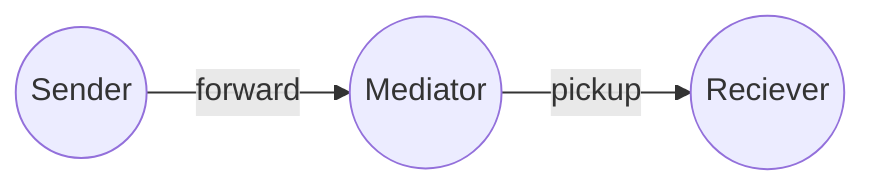

# Atala Prism Mediator (DIDCOMM v2)

A DIDCOMM v2 mediator  
A service that receives messages for many agents at a single endpoint and stores them with privacy.
A cloud-based agent that forwards messages to mobile devices.

 - **CI** automate builds and tests all pushes to the main branch also as all PRs created.
 - **Scala Steward** automate the creation of pull requests for libraries with updated dependencies, saving maintainers time and effort. It can also help ensure that libraries are kept up-to-date, improving their reliability and performance.

**More documentation:**
- [LICENSE](LICENSE) - Apache License, Version 2.0

## Protocols
- [DONE] `BasicMessage 2.0` - https://didcomm.org/basicmessage/2.0
- [DONE] `MediatorCoordination 2.0` - https://didcomm.org/mediator-coordination/2.0
- [TODO] `MediatorCoordination 3.0` - https://didcomm.org/mediator-coordination/3.0
- [DONE] `Pickup 3` - https://didcomm.org/pickup/3.0
- [DONE] `TrustPing 2.0` - https://didcomm.org/trust-ping/2.0/

## How to run

### server

**Start the server**:
 - shell> `docker-compose up mongo`
 - sbt> `mediator/reStart`
### webapp

The webapp/webpage is atm just to show the QRcode with out of band invitation for the Mediator.

**Compile** - sbt> `webapp / Compile / fastOptJS / webpack`

**Open the webpage for develop** - open> `file:///.../webapp/index-fastopt.html`

## Run

This DIDComm Mediator is composed of two elements, a backend service and a the database.
The backend service is a JVM application and the database used is MongoDB.
The backend service is also a web service that have a single page application that will give the final user a invitation page.

### Run localy

Everything can be run with a single command with Docker compose `docker-compose.yml`

First build to docker image with `NODE_OPTIONS=--openssl-legacy-provider sbt docker:publishLocal`.
The latest stable image version can also downloaded from the IOHK repositories.

### MongoBD

Docker compose would do that for you but if you are running separately or on the cloud like MongoDB Atlas.
You will need to create the table and indexs before start the backend service. See the file `initdb.js`.

### Deploy

You can easy deploy the image everywhere. We recommend a minimum of 250 mb ram to run the mediator backend service.
