# SCALA DID

A Scala/ScalaJS library for DID and DIDcomm.
The one of the main goals of this library is to make DID Comm v2 **type safety** and easy to use.
Made for developers by developers.

[**LIVE DEMO (DIDComm's Sandbox)**](https://did.fmgp.app/)

[**Scala-DID Documentation**](./docs/readme.md)

 - **CI** automate builds and tests all pushes to the master branch also as all PRs created.
 - **Scala Steward** automate the creation of pull requests for libraries with updated dependencies, saving maintainers time and effort. It can also help ensure that libraries are kept up-to-date, improving their reliability and performance.

The future version of **DID Comm v2.1** is been track&develop in the branch [`didcomm-v2.1`](https://github.com/FabioPinheiro/scala-did/tree/didcomm-v2.1)

**More documentation:**
- [LICENSE](LICENSE) - Apache License, Version 2.0
- [did implementations](did-imp/README.md) = Notes and TODO list
- [example](did-example/README.md) - just a set of DIDs for experiments.
- [demo](demo/README.md) - How to build, test and deploy the Demo. The Demo is a server with (webapp) client.  
- [webapp module](webapp/README.md) - How to build, develop and run localy.
- [multiformats module](multiformats/README.md) -(Implemente notes and an considerations (of TODOs) if we want to use as the independent Library.
- [docs](docs/) - Base folder of the library documentation website.
  - [docs/readme.md - **Scala-DID Documentation**](docs/readme.md)

## Protocols
- [WIP] `Routing`- https://didcomm.org/routing/2.0
  - Also see https://didcomm.org/book/v2/routing
- [DONE] `BasicMessage 2.0` - https://didcomm.org/basicmessage/2.0
- [TODO]`ReportProblem 2.0` - https://didcomm.org/report-problem/2.0
- [WIP] `TrustPing 2.0` - https://didcomm.org/trust-ping/2.0/
- [TODO] `DiscoverFeatures 2.0` - https://didcomm.org/discover-features/2.0
- Create new protocol `PreSetValue`
- Create new protocol `PseudoRandom`
  - https://www.stat.berkeley.edu/~stark/Java/Html/sha256Rand.htm
  - https://www.rfc-editor.org/rfc/rfc3797

## TODO/WIP

- We are still working on core API.
  - decrypting a file MUST be one of the following combinations: [See this like](https://identity.foundation/didcomm-messaging/spec/#iana-media-types)
- [TODO!] [Message Layer Addressing Consistency](https://identity.foundation/didcomm-messaging/spec/#message-layer-addressing-consistency)
- did-rotation: https://identity.foundation/didcomm-messaging/spec/#did-rotation
  - support `from_prior`
  - support `sub` `iss` on JWT https://datatracker.ietf.org/doc/html/rfc7519
- create module for protocols
- method `did:jwk` https://github.com/quartzjer/did-jwk
- routing:
  - implement a mediator [WIP]
    - websocket
    - HTTP POST
    - push notification
  - implement a relay
    - [WIP] NFC
    - websocket
    - bluetooth
- maybe implement ["KERI lite"](https://docs.google.com/presentation/d/1ksqVxeCAvqLjr67htWZ4JYaSnI8TUZIO7tDMF5npHTo/edit#slide=id.g1ca1fd90f33_0_0)
- be part of the Adopters in https://github.com/sbt/sbt-ci-release/
- Remove field `kty` from `ECPublicKey` and `OKPPublicKey`. Make custom json encoder/decoder
- Webapp UI:
  - resolver the did 'from' in the OOB botton
  - OOB text box -> url

## Benefits of type safety

- It would help prevent errors by ensuring that only valid DIDs are used, and that the library does not attempt to perform any invalid operations on them. This could help ensure that the library functions correctly and reliably.

- It would make the code easier to read and understand, by making it clear what types of values are being used and what operations are being performed on them. This could make it easier for developers to work with the library and understand its functionality. **Speeding up the development of applications**

- It could make the library more efficient, by allowing the compiler to optimize the code for working with DIDs. This could make the library run faster and more efficiently.

- It could improve the reliability and correctness of the library, by catching any errors or bugs related to invalid DIDs or invalid operations at compile time. This could save time and effort in the development process and help prevent potential issues in the final library.

I usually say if it compiles it probably also works! 

## Project Structure and Dependencies Graph

```mermaid
flowchart BT

  did --> zio
  zhttp --> zio
  did --> zio-json
  did-resolver-web ----> zhttp:::JVM
  
  did-example ----> did
  did-example --> did-imp
  did-example  --> did-resolver-web
  demo --> did-imp 

  subgraph fmgp libraries
    did-extra --> did
    subgraph platform specific
      did-imp
      did-imp-hw:::Others -.-> did-imp
      did-imp_js:::JS ==>|compiles together| did-imp
      did-imp_jvm:::JVM ==>|compiles together| did-imp
    end
    did-resolver-peer --> multibase
    did-resolver-peer --> did
    did-resolver-web --> did
    did-imp --> did
  end
  
  did-imp_jvm:::JVM ----> nimbus-jose-jwt:::JVM --> google-tink:::JVM
  did-imp_jvm:::JVM ---> google-tink

  did-imp_js ----> jose:::JS

  %% subgraph demo/docs
    
    webapp:::JS --> did-imp_js
    webapp:::JS  --> did-resolver-web
    demo  --> did-example
    demo --> did-resolver-web
    demo --> did-resolver-peer
    demo -.->|uses\serves| webapp
    demo_jvm(demo_jvm\nA server):::JVM ==>|compiles together| demo
    webapp:::JS  --> did-resolver-peer
    webapp:::JS  --> did-example
    did-example  --> did-resolver-peer

  %% end

  classDef JVM fill:#141,stroke:#444,stroke-width:2px;
  classDef JS fill:#05a,stroke:#444,stroke-width:2px;
  classDef Others fill:#222,stroke:#444,stroke-width:2px,stroke-dasharray: 5 5;

```

NOTES:

- The things inside the group box (fmgp) are implemented on this repository and that are intended to be published as a library.
- Green boxes is JVM's platform specific.
- Blue boxes is JavaScript's platform specific.
- Other boxes are not platform specific.
- The `did-imp-hw` is a idea how to extend for other implementation. Lika a Hardware/platform specific.
- `did-resolver-web` & `did-resolver-peer` are implementations of the respective did methods.

