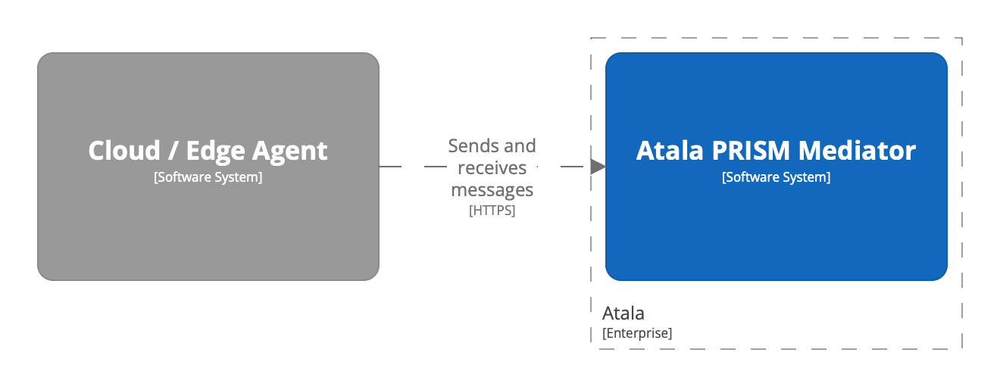
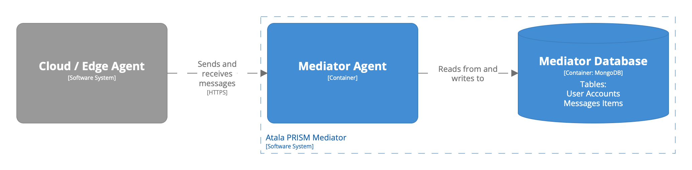
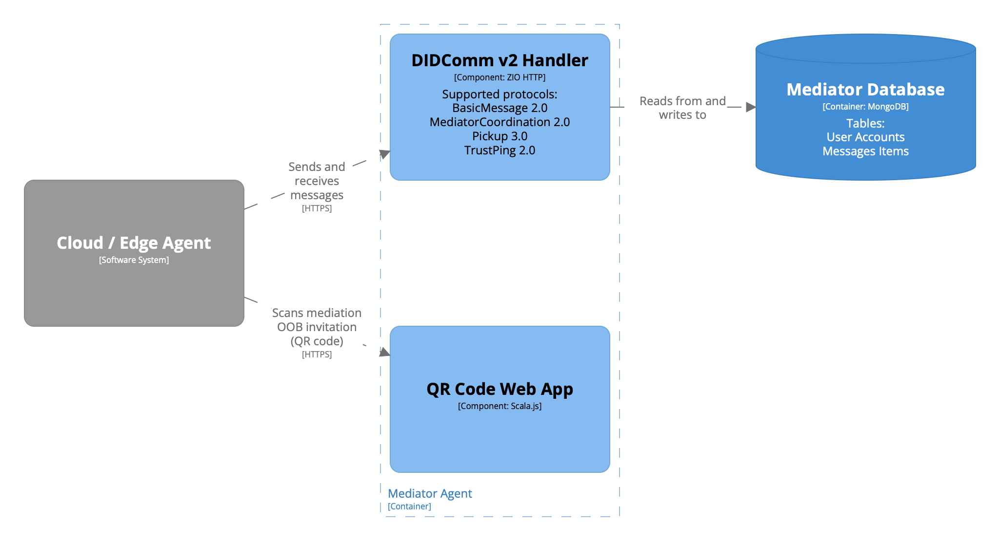

# System Architecture

This document provides an overview of the system architecture for the Atala PRISM Mediator.

## System Context Diagram

The system context diagram illustrates the high-level interactions and dependencies of the Atala PRISM Mediator with
external components, mainly cloud and edge agents.

## Container Diagram

The container diagram depicts the internal containers/runnables and their relationships within the Atala PRISM Mediator.

### Mediator Agent Component Diagram

The Mediator Agent handles the communication and coordination tasks of the Atala PRISM Mediator.

- **DIDComm v2 Handler**: This component supports various protocols such as BasicMessage 2.0, MediatorCoordination 2.0,
  Pickup 3.0, and TrustPing 2.0. It communicates with external systems via HTTP.

- **QR Code Web App**: This component is responsible for displaying a QR code containing an OOB invitation that can be
  scanned by an edge agent mobile application to initiate a mediation request with the mediator.

### Mediator Database

The Mediator Database stores data related to the Atala PRISM Mediator. It contains the following tables:

- **User Accounts**: for storing user account information of mediated agents.

- **Message Items**: for storing messages sent by edge and cloud agents.

